# Application  stack MEAN ( mongodb express angular nodeJS)
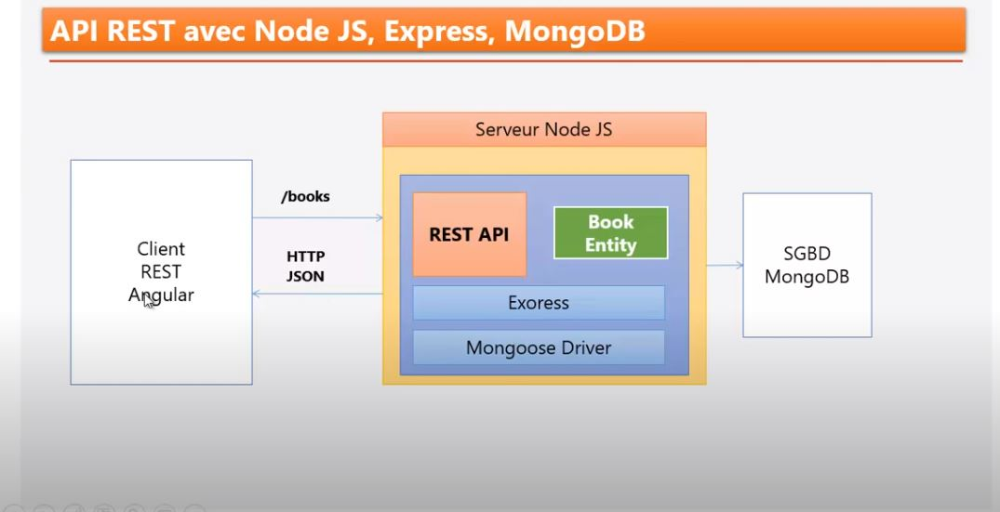

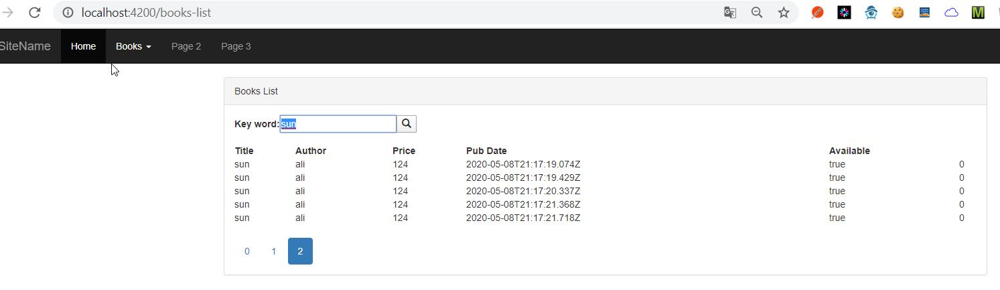

https://www.positronx.io/mean-stack-tutorial-angular-7-crud-bootstrap/ 
https://www.positronx.io/angular-8-mean-stack-tutorial-build-crud-angular-material/  
https://www.djamware.com/post/5e50b735525fc968b04a707f/mean-stack-angular-9-build-realtime-crud-web-app-quickly  


Le composant **express** est utilisé commme restController.
Le composant **mongoose** est utilisé comme un ODM ( object document mapping) pour mongodb


## Sever

initialisation du projet
````shell script
λ npm init
This utility will walk you through creating a package.json file.
It only covers the most common items, and tries to guess sensible defaults.

See `npm help json` for definitive documentation on these fields
and exactly what they do.

Use `npm install <pkg>` afterwards to install a package and
save it as a dependency in the package.json file.

Press ^C at any time to quit.
package name: (bibliotheque_stack_mean)
version: (1.0.0)
description:
entry point: (index.js)
test command:
git repository:
keywords:
author:
license: (ISC)
About to write to C:\PERSONNEL\projet_nodejs\bibliotheque_stack_mean\package.json:

{
  "name": "bibliotheque_stack_mean",
  "version": "1.0.0",
  "description": "",
  "main": "index.js",
  "scripts": {
    "test": "echo \"Error: no test specified\" && exit 1"
  },
  "author": "",
  "license": "ISC"
}


Is this OK? (yes)
````


### fichier de configuration

**fichier  tsconfig.json**      
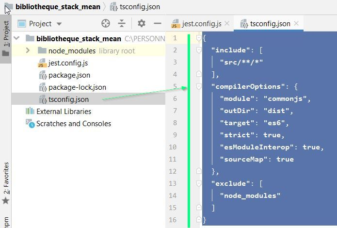

**fichier package.json**
Ajouter les scripts de demarrage pour la dev et la prod
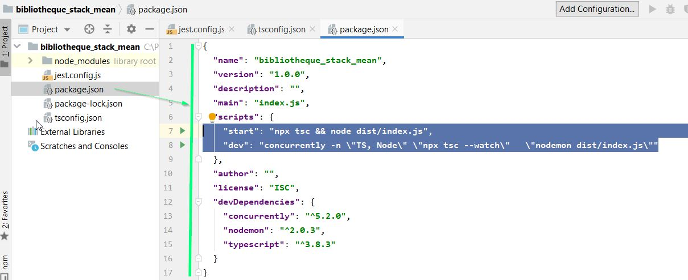


#### installer les dependances;
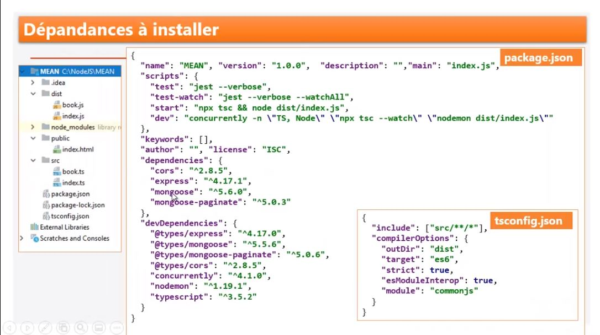

**Dependances pour le developpement**
````shell script
λ npm install --save-dev typescript  nodemon concurrently

+ concurrently@5.2.0
+ nodemon@2.0.3
+ typescript@3.8.3
````
rappel pour lancer la dev:  **npm run dev**


**Dependance pour la production**
mongoose un un utilitaire d'acces à mongodb
````shell script
λ npm install --save  express  @types/express  mongoose  mongoose-paginate @types/mongoose-paginate cors @types/cors
+ express@4.17.1
+ @types/express@4.17.6
+ mongoose@5.9.12
+ mongoose-paginate@5.0.3
+ @types/mongoose-paginate@5.0.8
+ cors@2.8.5
+ @types/cors@2.8.6
````

rappel pour lancer la prod:  **npm run start**


### creation d'un model  ( ou entity)

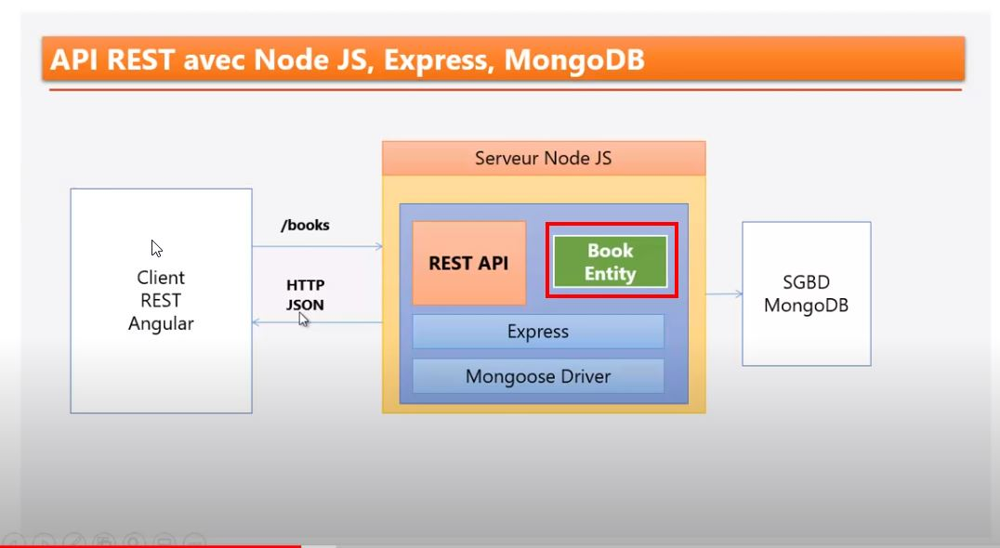

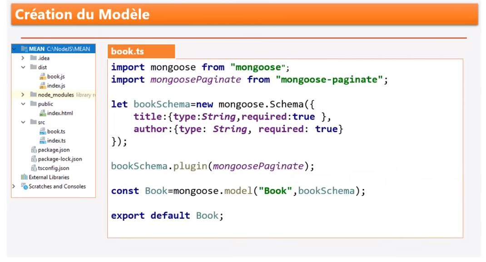


#### Creation Api rest

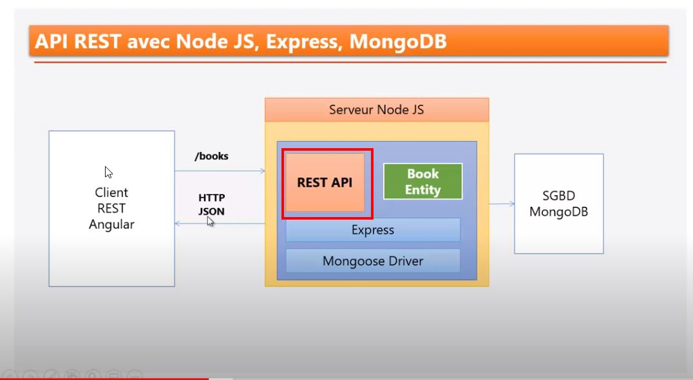 

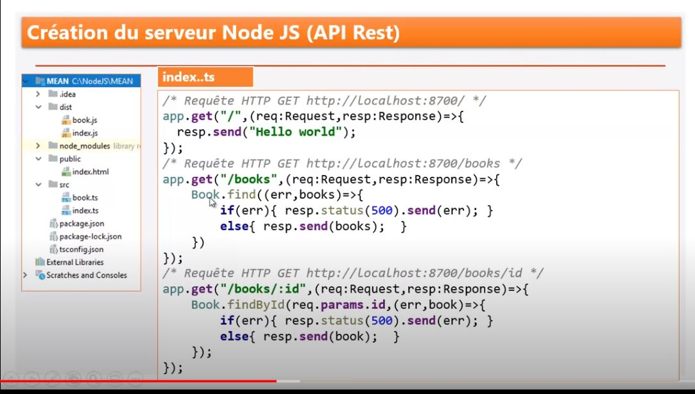 

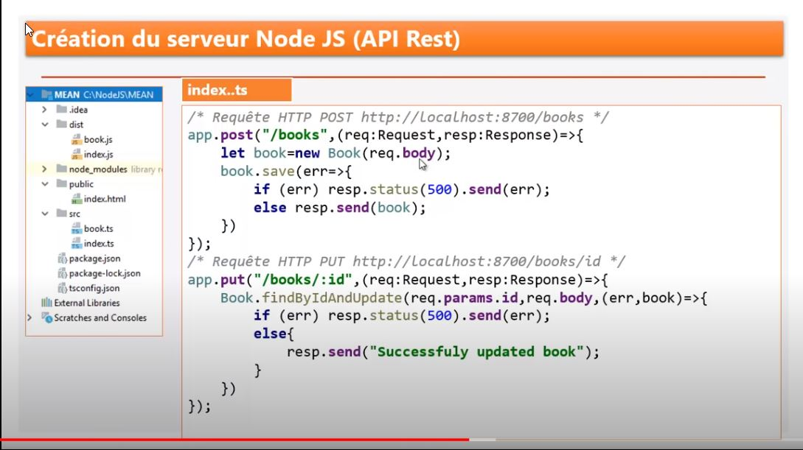 


## client angular

`````shell script
C:\PERSONNEL\projet_nodejs\bibliothequeangular>npm install bootstrap@3  jquery --save
+ jquery@3.5.1
+ bootstrap@3.4.1
`````


````shell script
C:\PERSONNEL\projet_nodejs\bibliothequeangular>ng generate interface models/book --type=model
CREATE src/app/models/book.model.ts (26 bytes)

C:\PERSONNEL\projet_nodejs\bibliothequeangular>ng g s  services/books-service
CREATE src/app/services/books-service.service.spec.ts (388 bytes)
CREATE src/app/services/books-service.service.ts (141 bytes)

C:\PERSONNEL\projet_nodejs\bibliothequeangular>ng g c home
CREATE src/app/home/home.component.html (19 bytes)
CREATE src/app/home/home.component.spec.ts (614 bytes)
CREATE src/app/home/home.component.ts (267 bytes)
CREATE src/app/home/home.component.css (0 bytes)
UPDATE src/app/app.module.ts (467 bytes)

C:\PERSONNEL\projet_nodejs\bibliothequeangular>ng g c booksNew
CREATE src/app/books-new/books-new.component.html (24 bytes)
CREATE src/app/books-new/books-new.component.spec.ts (643 bytes)
CREATE src/app/books-new/books-new.component.ts (286 bytes)
CREATE src/app/books-new/books-new.component.css (0 bytes)
UPDATE src/app/app.module.ts (559 bytes)

C:\PERSONNEL\projet_nodejs\bibliothequeangular>
C:\PERSONNEL\projet_nodejs\bibliothequeangular>ng g c booksList
CREATE src/app/books-list/books-list.component.html (25 bytes)
CREATE src/app/books-list/books-list.component.spec.ts (650 bytes)
CREATE src/app/books-list/books-list.component.ts (290 bytes)
CREATE src/app/books-list/books-list.component.css (0 bytes)
UPDATE src/app/app.module.ts (655 bytes)

````

## mongoDB
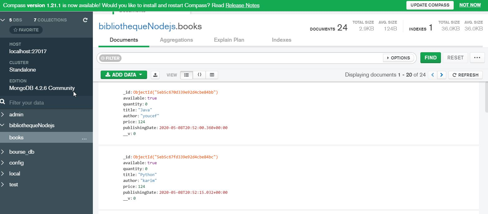


