# nodeJS

## Application  
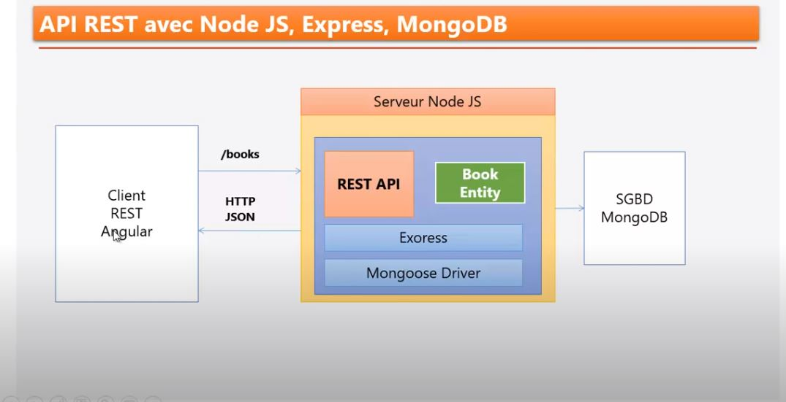

## nodeJS principe
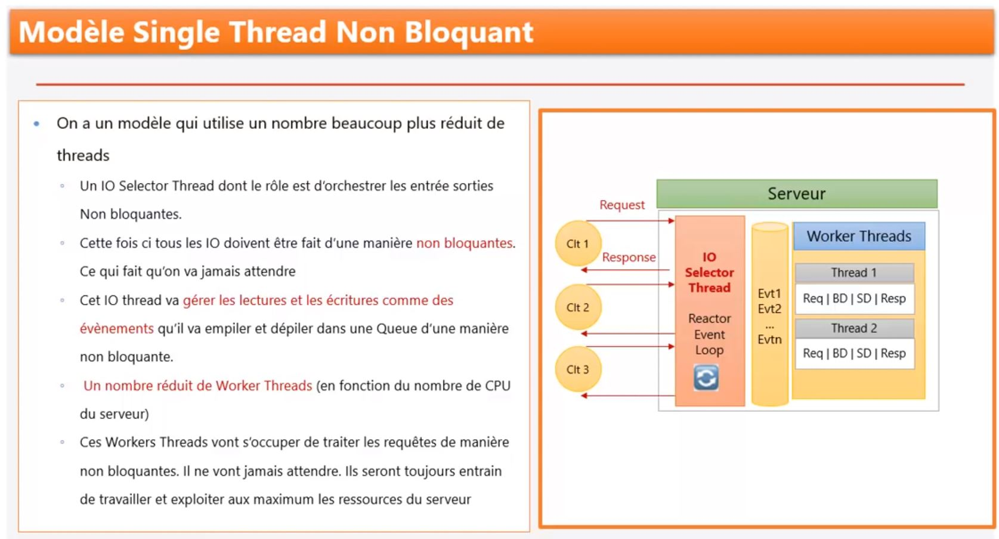

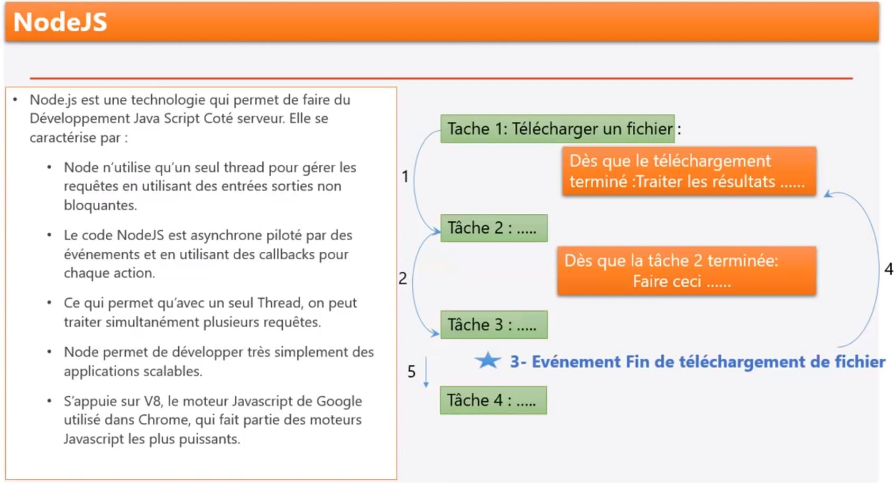


## installation
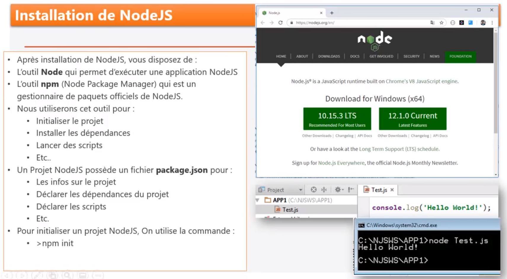


## Creation d'un nouveau projetNodeJs
````shell script
λ mkdir nodeJsTypeScriptExpress

C:\PERSONNEL\projet_nodejs
λ cd nodeJsTypeScriptExpress\
````

````shell script
C:\PERSONNEL\projet_nodejs\nodeJsTypeScriptExpress
λ npm init -y
Wrote to C:\PERSONNEL\projet_nodejs\nodeJsTypeScriptExpress\package.json:

{
  "name": "nodeJsTypeScriptExpress",
  "version": "1.0.0",
  "description": "",
  "main": "index.js",
  "scripts": {
    "test": "echo \"Error: no test specified\" && exit 1"
  },
  "keywords": [],
  "author": "",
  "license": "ISC"
}
````


## express

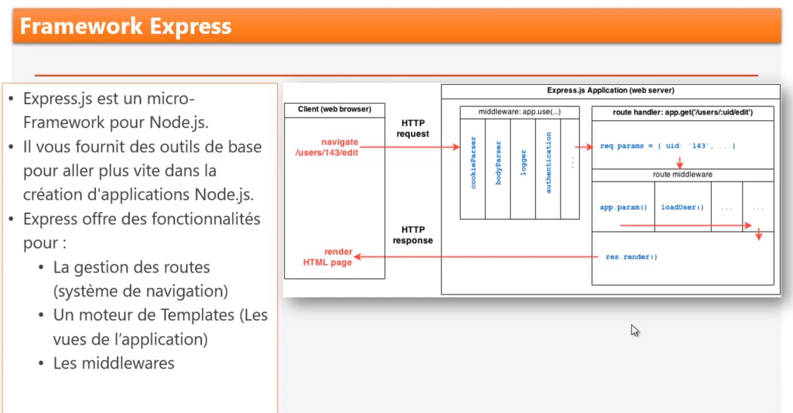

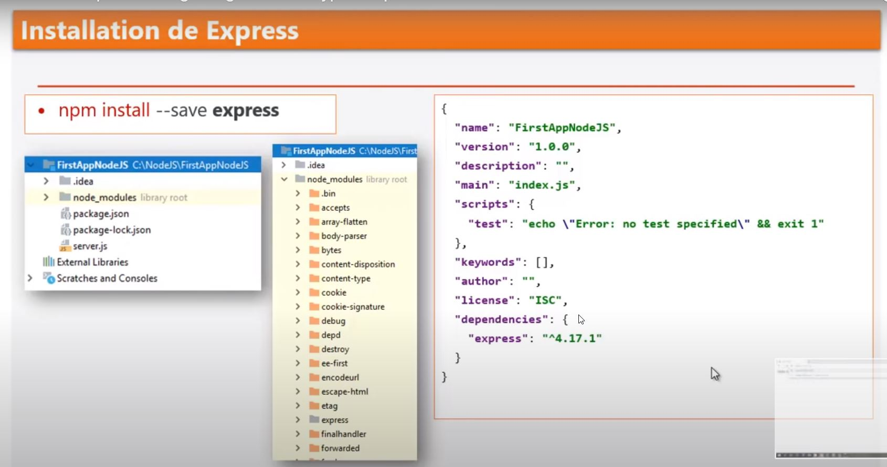

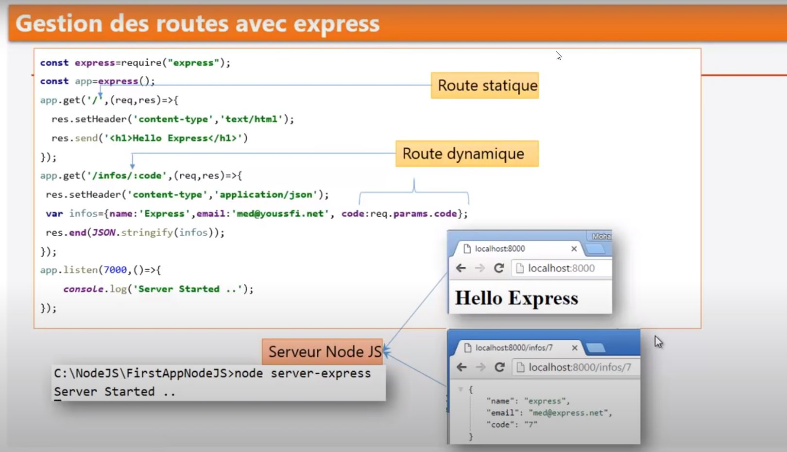

installer **express**  et la dependance pour typescript **@type/express**
````shell script
λ npm install --save express @types/express
+ express@4.17.1
+ @types/express@4.17.6
````


## utliser avec TypeScript
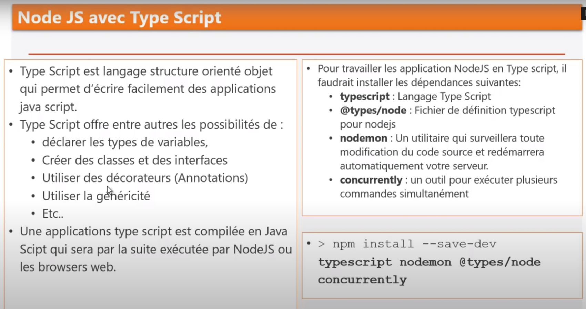


Pour utiliser TypeScript au lieu de javaScript ses dépendances sont nécessaires. Il faut les installer uniquement pour le developpement. "--save-dev"
````shell script
λ npm install --save-dev typescript @types/node nodemon concurrently                                                                                                                                                                            
+ concurrently@5.2.0                                                                                                           
+ nodemon@2.0.3                                                                                                                
+ @types/node@13.13.5                                                                                                          
+ typescript@3.8.3                                                                                                                                                                                                                                                                                                                                                                                                                                                                     
````
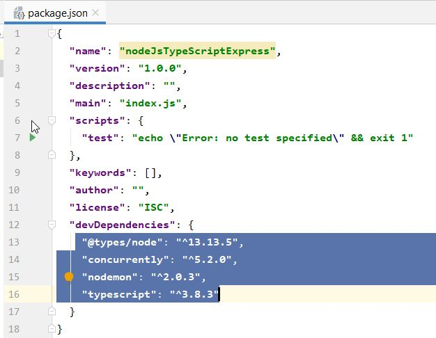

### compilation typescript
execute la command tsc ( insallé en local ) 
````shell script
C:\PERSONNEL\projet_nodejs\nodeJsTypeScriptExpress>npx tsc
````

### generation d'un fichier dist
Apres la commande de compilation de typescirpt via la commande **tsc**, le compilateur génère les javascripts files dans le répertoire **dist**
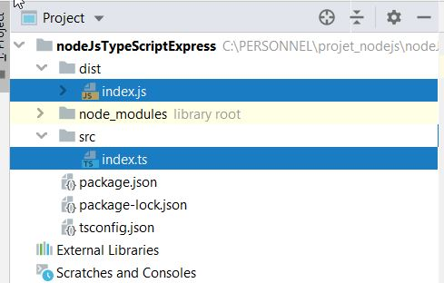


### execution du fichier javascript généré (index.js) suite à la compilation
`````shell script
λ dir dist\
 Le volume dans le lecteur C s’appelle OS
 Le numéro de série du volume est 2E66-D7B4

 Répertoire de C:\PERSONNEL\projet_nodejs\nodeJsTypeScriptExpress\dist

07/05/2020  17:02    <DIR>          .
07/05/2020  17:02    <DIR>          ..
07/05/2020  17:02                85 index.js
07/05/2020  17:02               150 index.js.map
               2 fichier(s)              235 octets
               2 Rép(s)  11 632 459 776 octets libres

C:\PERSONNEL\projet_nodejs\nodeJsTypeScriptExpress  (nodeJsTypeScriptExpress@1.0.0)
λ node dist\index.js.js
Test type script

`````
### Compilation automatisé
fichier tsconfig.json

````shell script
../..
 "scripts": {
    "test": "echo \"Error: no test specified\" && exit 1",
    "start": "npx tsc && node dist/index.js",
     "dev": "concurrently -n \"TS, Node\" \"npx tsc --watch\" \"nodemon dist/index.js\""
  },
````

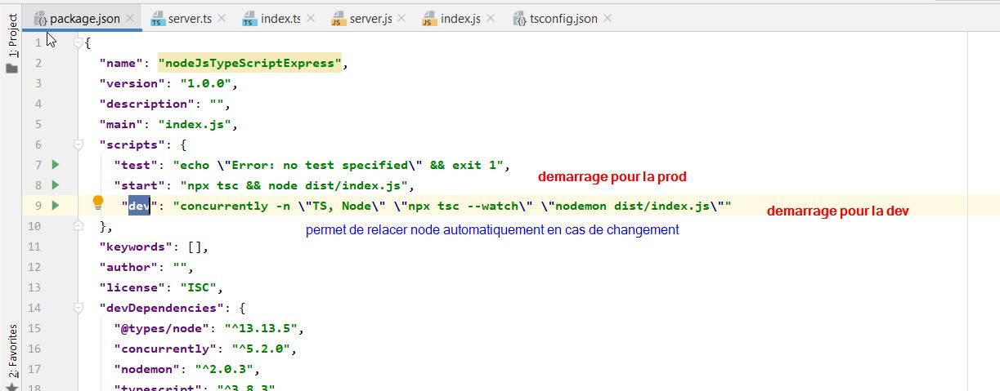


## test unitaire Jest

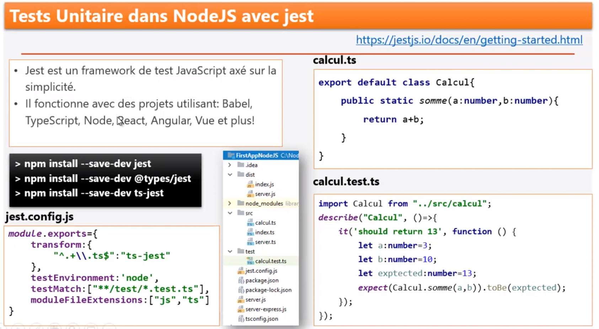

````shell script
λ npm install --save-dev jest @types/jest  ts-jest
+ jest@26.0.1
+ @types/jest@25.2.1
+ ts-jest@25.5.0
````


### automatisé les test
Configuration du fichier package.json
````shell script
  "scripts": {
    "test": "npx jest --verbose",
    "test-watch": "npx jest --verbose --watchAll",
   
    "start": "npx tsc && node dist/index.js",
    "dev": "concurrently -n \"TS, Node\" \"npx tsc --watch\" \"nodemon dist/index.js\""
  }
````


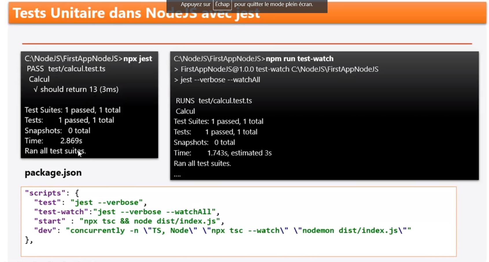


````shell script
C:\PERSONNEL\projet_nodejs\nodeJsTypeScriptExpress>npm run test

> nodeJsTypeScriptExpress@1.0.0 test C:\PERSONNEL\projet_nodejs\nodeJsTypeScriptExpress
> npx jest --verbose

ts-jest[versions] (WARN) Version 26.0.1 of jest installed has not been tested with ts-jest. If you're experiencing issues, consider using a supported version (>=25.0.0 <26.0.0). Please do not report issues in ts-j
est if you are using unsupported versions.
 PASS  test/calcul.test.ts
  Calcul
    √ should return 13 (2 ms)

Test Suites: 1 passed, 1 total
Tests:       1 passed, 1 total
Snapshots:   0 total
Time:        0.993 s, estimated 1 s
Ran all test suites.
````


mieux lancer les test unitaires avec l'option test-watch pour voir en continue les test unitaires
````shell script
C:\PERSONNEL\projet_nodejs\nodeJsTypeScriptExpress> npm run test-watch


> npx jest --verbose --watchAll
ts-jest[versions] (WARN) Version 26.0.1 of jest installed has not been tested with ts-jest. If you're experiencing issues, consider using a supported version (>=25.0.0 <26.0.0). Please do not report issues in ts-j
est if you are using unsupported versions.
 PASS  test/calcul.test.ts
  Calcul
    √ should return 13 (2 ms)

Test Suites: 1 passed, 1 total
Tests:       1 passed, 1 total
Snapshots:   0 total
Time:        1.371 s, estimated 3 s
Ran all test suites.

Watch Usage
 › Press f to run only failed tests.
 › Press o to only run tests related to changed files.
 › Press p to filter by a filename regex pattern.
 › Press t to filter by a test name regex pattern.
 › Press q to quit watch mode.
 › Press Enter to trigger a test run.

````

et lancer l'application en environnement de **dev** via
`````shell script
npm run dev
`````


## express MiddleWare

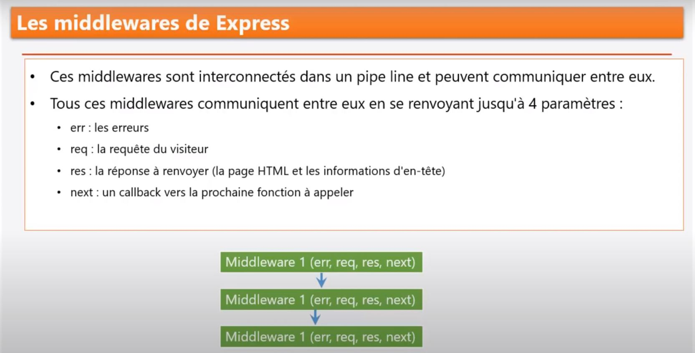

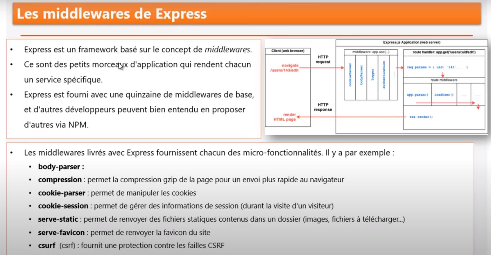

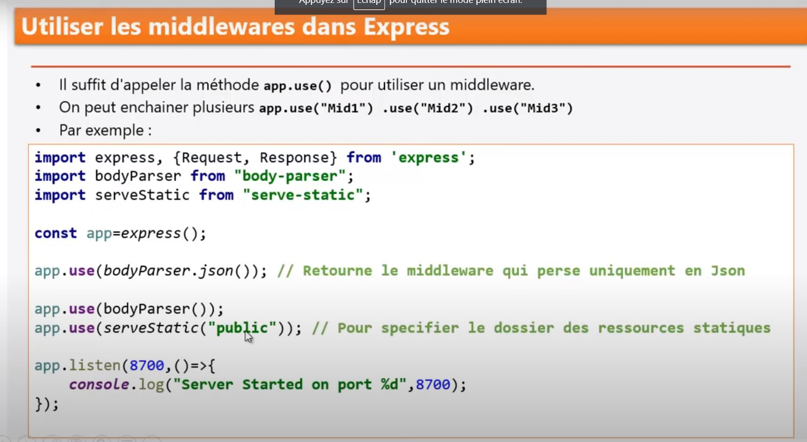


[mise en oeuvre](doc/application.md)